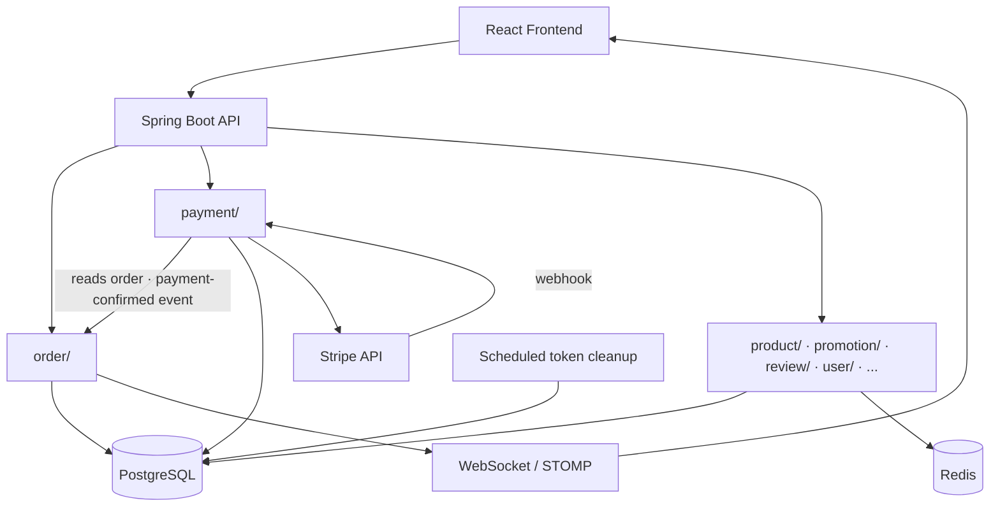

# Sushi Shop

Online sushi delivery shop with real-time order tracking.


---

## Overview

Sushi Shop is a full-stack monolith application for online food ordering.
It covers the full order lifecycle: browsing the menu, placing an order,
payment, and real-time delivery tracking.

The system supports three roles:
- **User** — browsing, ordering, tracking
- **Admin** — managing products, promotions, orders, audit logs
- **Courier** — order management and delivery status updates (shares the admin
  order view, without product/promotion access)

---

## Demo

[](https://www.youtube.com/watch?v=RCVogRldj4Q)

---

## Features

### Storefront
- Product catalog with categories, search, images, reviews, and ratings
- Active promotions with automatic discount calculation
- Shopping cart and checkout
- Order tracking with real-time status updates via WebSocket
- Stripe payment integration
- User profile management
- JWT authentication with email verification
- Google OAuth2 login
- Responsive design

### Admin Panel
- Full product CRUD with image management
- Promotion management with conflict prevention
- Order management with status workflow
- Real-time order updates via WebSocket
- Audit logs with filtering

### Courier Access
- Reuses the admin order management view — update order status, filter/search orders
- No product or promotion management access

---

## Key Engineering Highlights

- **Feature-based architecture** — organized the monolith by business domains with clear separation of controllers, services, repositories, DTOs, and mappers
- **Database optimization** — eliminated N+1 queries using `EntityGraph`, batch fetching, and targeted database indexes
- **Dynamic filtering** — implemented composable filtering with Spring Data JPA Specifications for products, orders, and audit logs
- **Promotion conflict prevention** — prevents a product from being assigned to multiple active promotions
- **Real-time order tracking** — WebSocket/STOMP updates order status automatically across clients
- **Cross-cutting audit logging** — implemented with a custom `@Auditable` annotation and AOP
- **Drag-and-drop image reordering** — admin can reorder product images
- **Service layer separation** — split large services into focused services (OrderCreationService, OrderQueryService, ProductImageService, ReviewReplyService)
- **Validation hierarchy** — custom exceptions for all HTTP error scenarios with centralized handling
- **Token management** — separate TokenService for verification and password reset tokens
- **Scheduled cleanup** — automated cleanup of expired tokens and rate-limit buckets
- **Email verification flow** — async email sending with styled HTML templates
- **Accessibility (WCAG AA)** — dedicated audit and fixes: color-contrast across
  light/dark themes, focus-visible styles, focus trap/restoration in modals,
  ARIA labels on icon-only controls, full keyboard navigation
- **Resilience** — root `ErrorBoundary` to prevent white-screen crashes,
  custom 404 handling

---

## Architecture

**Feature-based package structure:** each business domain (`product/`, `promotion/`, `order/`, `payment/`, `review/`, `audit/`) is a self-contained package with its own `controller/service/repository/dto/mapper`, instead of one global layer shared by the whole app. `user/`, `auth/`, and `token/` cover identity and access together. `mail/`, `file/`, and `scheduler/` are shared infrastructure called *by* a domain rather than making business decisions themselves. `security/` and `shared/` stay global — JWT/WebSocket auth, rate limiting, validation, exceptions, config.



**Domain packages:**

| Package                     | Responsibility                                                    |
| ---------------------------- | ------------------------------------------------------------------ |
| `product/`                   | Catalog, categories, images                                        |
| `promotion/`                 | Promotions, discount rules, conflict prevention                    |
| `order/`                     | Order lifecycle, checkout, real-time status via WebSocket/STOMP    |
| `payment/`                   | Stripe payment processing                                          |
| `review/`                    | Product reviews, ratings, admin replies                            |
| `audit/`                     | `@Auditable` AOP change log across admin actions                   |
| `user/` · `auth/` · `token/` | Registration, JWT/OAuth2 login, email verification & reset tokens |
| `mail/`                      | Async email sending (verification, notifications)                  |
| `file/`                      | Product image storage                                              |
| `scheduler/`                 | Expired-token and rate-limit-bucket cleanup                        |
| `security/`                  | JWT filter, WebSocket auth, rate-limit config                      |
| `shared/`                    | Cross-cutting config, exceptions, validation, enums, events        |

---

## Security Highlights

- **Role-Based Access Control (RBAC):** separate workflows and permissions for User, Admin, and Courier, enforced at both API and UI level.
- **API rate limiting:** configurable per-endpoint throttling via Bucket4j, with scheduled cleanup of expired buckets.
- **Security hardening:** CSP/HSTS/X-Frame-Options headers via Nginx, Dependabot dependency scanning across npm/Gradle/GitHub Actions, authenticated WebSocket subscriptions.
- **Auth:** JWT + Google OAuth2 login, email verification required before account access, BCrypt password hashing.

---

## Tech Stack

### Backend

| Technology                  | Version               |
| ----------------------------- | ------------------------ |
| Java                         | 21                     |
| Spring Boot                  | 4.0.7                  |
| Spring Security               | Spring Boot-managed     |
| Spring Data JPA / Hibernate   | Spring Boot-managed     |
| PostgreSQL                   | 16                     |
| Redis                         | 7                      |
| Flyway                        | Spring Boot-managed     |
| JWT (jjwt)                    | 0.12.6                 |
| MapStruct                     | 1.6.3                  |
| WebSocket / STOMP              | Spring Boot-managed     |
| Stripe                        | 33.1.1                 |
| Google OAuth2 Client           | Spring Boot-managed     |
| Bucket4j                      | 8.10.1                 |
| Testcontainers                | 1.20.6                 |
| Spring AOP                    | Spring Boot-managed     |
| Spring Scheduling              | Spring Boot-managed     |
| Spring Mail                   | Spring Boot-managed     |

### Frontend

| Technology         | Version        |
| -------------------- | ---------------- |
| React                | 19.2.7          |
| TypeScript            | 6.0.2           |
| Vite                  | 8.1.1           |
| React Router DOM       | 7.18.1          |
| Axios                 | 1.18.1          |
| STOMP.js              | 7.3.0           |
| SockJS Client          | 1.6.1           |
| dnd-kit               | 6.3.1           |
| Tailwind CSS           | 4.3.2           |
| CSS Modules            | native (Vite)   |

### DevOps & Tools

| Technology     | Description                   |
| :------------- | :----------------------------- |
| Docker         | Containerization                |
| Docker Compose | Multi-container orchestration  |
| Prometheus     | Metrics collection              |
| Grafana        | Metrics dashboards              |
| GitHub Actions | CI/CD pipeline                  |

---

## Getting Started

### Option 1: Docker Setup (Recommended)

```bash
git clone https://github.com/AntonBas/sushi-shop.git
cd sushi-shop
cp .env.example .env
docker compose up -d
```

Fill in the required values in `.env`.
See [`.env.example`](.env.example) for all available variables.

| Service     | URL                                   |
| ----------- | ------------------------------------- |
| Frontend    | http://localhost:5173                 |
| Backend API | http://localhost:8080                 |
| Swagger     | http://localhost:8080/swagger-ui.html |
| Prometheus  | http://localhost:9090                 |
| Grafana     | http://localhost:3000                 |

Swagger UI is enabled only under the `docker` Spring profile used here
(local/demo). The default profile disables `springdoc` intentionally, so a
stricter production deployment would not expose it.

### Option 2: Local Development Setup

Run backend and frontend separately for faster iteration; only Postgres and
Redis stay in Docker.

**Backend**

```bash
cp .env.example .env
docker compose up -d postgres redis
cd backend
cp ../.env .env
./gradlew bootRun
```

The default (non-`docker`) Spring profile already reads `DB_HOST`/`DB_PORT`/
`REDIS_HOST`/`REDIS_PORT` with `localhost` defaults matching the values in
`.env.example`, so no extra config is needed. Backend available at
http://localhost:8080.

**Frontend**

```bash
cd frontend
npm install
npm run dev
```

Frontend available at http://localhost:5173. Vite proxies `/api`, `/ws`,
`/oauth2`, and `/login/oauth2` to `http://localhost:8080` — no CORS
configuration or `VITE_API_URL` setup needed.

---

## Testing

Codebase is kept at zero warnings: ESLint runs with `--max-warnings 0` in CI
(fails the build on any warning), and the Java compiler is warning-free
(unchecked operations, MapStruct unmapped properties).

### Backend

- **Unit tests:** JUnit 5 + Mockito — services, mappers, validators, aspects
- **Integration tests:** Testcontainers with real PostgreSQL — Flyway migrations, repository queries
- **Controller tests:** MockMvc — REST API endpoints
- **Rate limiting tests:** Bucket4j token bucket behavior
- **Coverage:** Jacoco (~78% instruction coverage). Run `./gradlew jacocoTestReport`
  and open `backend/build/reports/jacoco/test/html/index.html`.

### Frontend

- **Unit/component tests:** Vitest + React Testing Library
- **Coverage:** `npm run test:coverage` (v8 provider), report at
  `frontend/coverage/index.html`. Test suite is a starting baseline, not
  full coverage yet — see `frontend/src/**/*.test.{ts,tsx}` for what's
  covered so far.

---

## CI/CD

GitHub Actions (`.github/workflows/ci.yml`) runs on every push/PR: backend
build + tests (Gradle), frontend lint + tests + build (ESLint, Vitest,
`tsc -b`, Vite). There is no deployment step — this is CI only, deployment
is manual via `docker compose up -d` (see Getting Started).

---

## Test Users

These accounts are for demonstration purposes only.

| Role    | Email             | Password |
|---------|-------------------|----------|
| User    | user@test.com     | user     |
| Admin   | admin@test.com    | admin    |
| Courier | courier@test.com  | courier  |

---

## License

[MIT](LICENSE)